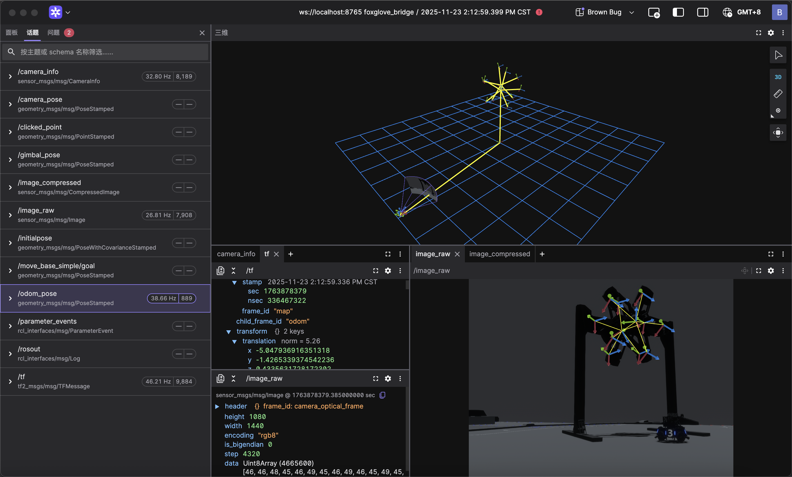

<div align="center">

# 🧪 Daedalus

**RoboMaster 视觉算法验证模拟器**

*为算法而生的实验场，让自瞄在上场前就经历真实考验*

[](https://www.rust-lang.org/)
[](https://bevyengine.org/)
[](https://www.ros.org/)
[](https://ubuntu.com/)

</div>

## 🚀 功能亮点

* 🎯 **全要素战场环境仿真**
  覆盖能量机关、前哨站、大/小装甲模块等 RoboMaster 核心视觉目标，提供高保真的外观与状态模拟。

* 🤖 **多机器人模型与行为**
  支持步兵（Infantry）与英雄（Hero）机器人的移动、底盘旋转、云台控制与弹丸发射。

* 🔄 **算法-数据-控制完整闭环**
  原生打通 **图像采集 → 目标标注 → ROS2/Talos 推理 → 云台反馈**，实现“看-算-打”全流程验证。

* ⚔️ **多主体动态对抗模拟**
  己方与多个假人独立控制，支持 Tab 键实时切换，真实构造遮挡、对抗与复杂战场场景。

* 🚀 **双通道实时通信接口**
    - **ROS2 原生集成**：直接发布图像、TF 与位姿话题，零成本接入现有自瞄系统
    - **Talos 零拷贝 IPC**：与 [talos](https://github.com/Blackjack200/talos) 通过共享内存通信，支持实时姿势发布与云台命令订阅

* ⚡️ **高性能实时渲染管线**
  基于 Bevy 引擎，支持 CPU/GPU 渲染，保证高帧率与严格的时间一致性。

---

## 🎨 功能覆盖与开发路线

### ✅ 已实现

#### 🏟️ 战场环境仿真

* **能量机关完整仿真** - 大/小能量机关的激活流程与视觉状态模拟
* **前哨站完整仿真** - 前哨站外观与装甲模块状态模拟
* **装甲模块建模与渲染** - 大、小装甲模块全部图案双色灯条显示

#### 🤖 机器人模型与行为

* **步兵机器人（Infantry）** - 移动、底盘旋转、云台控制、17mm弹丸发射
* **英雄机器人（Hero）** - 大装甲模块专属配置、移动与发射行为
* **物理动力学模拟** - 基于物理的移动、旋转与碰撞响应

#### 🔌 通信接口集成

* **ROS2 原生集成** - 发布 `/image_raw`、`/camera_info`、`/tf` 等话题，订阅 `/armor_solver/cmd_gimbal`
* **Talos 共享内存 IPC** - 与 C++ talos-cpp 零拷贝通信，发布 odom/gimbal/muzzle/camera 姿势，订阅云台控制命令

#### 📊 工具与接口

* **控制指令订阅** - 支持 ROS2 与 Talos 双通道控制指令接入
* **假人控制切换** - Tab 键实时切换活动假人，支持多机器人测试场景

#### ⚡️ 渲染与性能

* **高性能实时渲染管线** - 基于 Bevy 引擎，CPU/GPU 渲染支持，保证高帧率与时间一致性
* **多视角观测系统** - 自由视角、第一人称、第三人称视角切换（F3键）

---

### 🔄 近期计划

* **ROS2 自定义相机外参支持**

---

### 🚀 规划中功能

* **多机器人协同仿真**（步兵 / 英雄 / 哨兵）
* **弹道模拟与落点校准验证**
* **相机成像参数模拟**（曝光、白平衡、畸变）
* **多光照条件与环境变化模拟**

---

## 💡 使用说明

### 环境要求

推荐环境：

* Ubuntu 24.04（原生系统或双系统）
* Rust stable（建议通过 `rustup` 安装）
* 支持 Vulkan 1.3 的显卡与驱动
* CMake、Ninja、OpenCV、Eigen、yaml-cpp（联调 C++ 视觉工程时需要）

确认基础环境：

```bash
rustc --version
cargo --version
vulkaninfo --summary
```

### 单独运行 Daedalus

```bash
cd <daedalus-repo>
cargo run --release
```

`cargo run --release` 会增量编译发生变化的 Rust 代码，然后启动仿真器。只编译不启动时使用：

```bash
cargo build --release
```

Linux 桌面版始终以主显示器上的普通最大化窗口启动，不申请独占全屏或无边框全屏，
也不会调用 `xrandr`/`nvidia-settings` 修改显示器布局。双屏应继续保持系统原有的扩展模式。

### 无 ROS：连接 `burn-your-bridges` 进行闭环仿真

Daedalus 与 `burn-your-bridges` 是两个独立进程，不复制源码、不使用 ROS，也不需要工业相机、串口或 CAN 设备。两端通过 Talos v3 共享内存协议交换数据：

```text
Daedalus -> RGB 图像、姿态、反馈和真值 -> vision_sim_runner -> 云台/发射命令 -> Daedalus
```

协议固定使用 `/tmp/talos_ipc_meta` 与 `/tmp/talos_ipc_image_pool`。因此同一台机器上一次只能运行一个 Daedalus 实例和一个算法实例。

#### 首次构建

在两个仓库分别执行：

```bash
cd <daedalus-repo>
cargo build --release

cd <burn-your-bridges-repo>/sim-vision
cmake -S . -B build -G Ninja
cmake --build build --target vision_sim_runner vision_sim_runner_debug -j2
```

#### 1. 启动 Daedalus

在第一个终端启动仿真器。先删除上次异常退出可能遗留的共享内存文件：

```bash
cd <daedalus-repo>
rm -f /tmp/talos_ipc_meta /tmp/talos_ipc_image_pool
DAEDALUS_FORCE_TALOS_CAPTURE=1 cargo run --release
```

仿真器窗口必须获得键盘焦点。启动算法前按 `F5` 开启 Talos 命令订阅；未开启时仿真器仍会发布图像和状态，但不会执行算法的云台与发射命令。

| 按键 | 作用 |
|---|---|
| `F5` | 开启/关闭 Talos 云台与发射命令订阅 |
| `F6` | 切换为 `AUTO_AIM`，复位能量机关 |
| `F7` | 切换为 `SMALL_BUFF`，启动小能量机关 |
| `F8` | 切换为 `BIG_BUFF`，启动大能量机关 |
| `F9` | 在识别蓝色与识别红色之间切换（默认识别蓝色） |
| `F10` | 当前 Scenario Target 使用普通匀速装甲板旋转 |
| `F11` | 当前 Scenario Target 使用正弦变速装甲板旋转 |
| `F12` | 停止当前 Scenario Target 的装甲板旋转 |

命令不会直接修改云台姿态，Daedalus 会按速度和加速度限制执行云台动力学。

#### 2. 启动 `burn-your-bridges` 算法

在第二个终端启动无设备算法入口。通用算法参数以真机的 `configs/sentry.yaml` 为基础；
`configs/daedalus_overlay.yaml` 通过代码白名单覆盖仿真域必须不同的少量参数，包括相机标定、
能量机关检测前端、仿真响应限制与开火脉冲适配。它不会整段替换 PnP、Solver、Tracker、
Predictor 或弹道配置。正式版默认不打开调试窗口：

```bash
cd <burn-your-bridges-repo>/sim-vision
./build/vision_sim_runner
```

需要观察识别画面以及 EKF/Planner 实时曲线时，改用调试版：

```bash
./build/vision_sim_runner_debug
```

调试版与 `sentry_mpc_debug` 一样，将 JSON 曲线数据发送到 UDP `127.0.0.1:9870`。
启动 PlotJuggler，添加 UDP Server 数据源、选择 JSON、监听端口 `9870`，即可拖入
`target_x`、`target_yaw`、`target_yaw_vel`、`residual_yaw`、`nis`、`plan_yaw`
和 `gimbal_yaw` 等曲线。

需要覆盖默认值时仍可显式传参，例如：

```bash
./build/vision_sim_runner configs/daedalus_overlay.yaml \
  --scenario=armor_regression \
  --truth-overlay=true \
  --max-frames=300
```

需要固定时长的回归运行时，加上 `--max-frames=300`。程序用 `Ctrl+C` 正常停止后，会在 `sim_reports/<scenario>-<timestamp>/` 新建会话目录，包含帧、命令、真值、命中事件、元数据与汇总报告。运行过程不会修改算法配置、基线文件或 Git 状态。

F10/F11/F12 只改变仿真目标的旋转工况，用来测试原有 EKF 在匀速、正弦变速和停止旋转下的表现；视觉算法不会自动切换到额外的正弦预测模型。

#### 能量机关仿真配置

Daedalus 渲染图像与真实相机存在域差异。当前仿真默认使用 `assets/buff.onnx` 与
ONNX Runtime CUDA，置信度阈值为 `0.1`，并启用仿真图像上的 R 中心细化；真机仍使用
`configs/sentry.yaml` 中的 XML 模型和阈值。大小符的 PnP、姿态解算与弹道求解代码保持共用。

为避免干净但离散的仿真观测长时间停留在 R 中心预瞄阶段，覆盖层恢复了经过仿真验证的
拟合启动、方向锁定和云台响应参数。能量机关只有在检测成功、旋转预测已拟合、弹道有效且
瞄准误差进入门限后才允许发射。`vision_sim_runner` 将满足条件的开火请求转换为最长 30 ms
的 Talos 脉冲，并限制为每 50 ms 最多一次，避免单帧命令被仿真器漏采样。

若能识别但不发射，先查看最新 `sim_reports/.../commands.jsonl` 中的：

* `prediction_fitted`：旋转预测是否完成初始化
* `ballistic_valid`：弹道是否有效
* `aligned`：云台是否进入仿真开火误差窗
* `planner_fire`：原始算法是否请求开火
* `sim_fire_ready` / `sim_fire_pulse`：仿真适配层是否产生可靠脉冲

### Scenario Control

Set `debug.egui = true` in `config.toml` and start Daedalus to display the **Scenario Control**
panel on the right side of the simulator window. The panel independently controls the scripted
`Infantry` and `Hero` targets. Target geometry is available after the asset has loaded.

| Control | Effect | Unit / range |
|---|---|---|
| `Enable scripted target` | Enables the selected position, vertical-motion and spin profile. Spin-only profiles keep the vehicle root dynamic; scripted translation uses kinematic integration. | Boolean |
| `Pair A` / `Pair B` height | Adds an independent local height offset to each geometrically opposite armor pair. Pair A is the lower baseline pair; Pair B is the other pair. | m, `[-1, 1]` |
| `Pair A` / `Pair B` radius | Sets the local XZ distance from the chassis center for each armor pair while preserving every armor's original radial direction. The initial values are measured from the loaded asset. | m, `[0.01, 2]` |
| `World XY motion` | Applies either a static X/Y offset or the configured polynomial-loop trajectory. | m / Hz |
| `World Z motion` | Applies a static height offset or sine motion using amplitude and peak velocity. | m / m/s |
| `Armor spin` | Applies off, constant-speed, or smooth sinusoidal variable-speed chassis spin. Variable spin continuously moves between the configured high and low speeds; it does not stop at the turning points. | rad/s / Hz |

Pair assignment is geometric, not based on model-node names. This keeps the same A/B meaning for
the current Infantry and Hero assets even though their armor layouts differ.

Changing height or radius is an instantaneous geometry change. Daedalus updates rendering, physics
collision transforms, and Talos ground truth together, but the external visual tracker still has its
old EKF state. Reset the visual tracker before evaluating a new geometry setting. Every panel edit
is appended to `parameter_events.jsonl`, including `armor_height_offsets_m` and `armor_radii_m`, so
an experiment can be reproduced from its session data.

When only armor spin is enabled, the enemy remains a dynamic rigid body. `I/J/K/L` therefore keeps
the same acceleration, inertia and collision response in `Off`, `Constant` and `Variable` spin
modes. Enabling scripted world XY/Z motion intentionally changes the root to kinematic integration.

### Runtime and Performance Settings

The current high-fidelity default renders a `1440x1080` Talos RGB camera at `120 Hz` physics with
`8` physics substeps. It also enables a screen preview, shadows, Egui and frame diagnostics. The
algorithm camera and the preview camera are separate renders, so this profile can show occasional
display-frame pacing stalls on CPU-bound systems even when GPU utilization is not saturated.

For a lower-overhead validation profile, set the following in `config.toml` and restart Daedalus:

```toml
[debug]
diagnostics = false

[preview]
enabled = false

[render]
shadows = false
```

`preview.enabled = false` disables only the screen preview; it does not disable Talos image capture
or the Scenario Control panel. Keep `window.present_mode = "auto_no_vsync"` for uncapped capture.
Do not use VSync as a performance workaround, because it can cap the visual-algorithm input rate at
the display refresh rate.

`physics.fixed_hz` and `physics.substep_count` are hot-reloaded when `config.toml` is saved. Lower
`substep_count` from `8` to `4`, and then lower `fixed_hz` from `120` to `100` only if the reduced
rendering profile is still too slow. This trades collision and ballistic fidelity for CPU headroom.
`debug.egui` and `preview.enabled` are startup settings and require a restart.

After source changes, rebuild and restart Daedalus; a running process keeps its old executable:

```bash
cd <daedalus-repo>
cargo build --release
DAEDALUS_FORCE_TALOS_CAPTURE=1 ./target/release/daedalus
```

### ROS2 接口

**发布话题**

* `/camera_info`
* `/image_raw` / `image_compressed`
* `/tf`
* `/gimbal_pose`
* `/odom_pose`
* `/camera_pose`

**订阅话题**

* `/armor_solver/cmd_gimbal`

### Talos 共享内存接口

Talos v3 是无 ROS 的双进程接口，使用 `/tmp/talos_ipc_meta` 与
`/tmp/talos_ipc_image_pool`，其中图像区为固定的 `1440x1080` RGB 三缓冲。

**发布帧**

* RGB 图像、`frame_seq`、Unix `timestamp_ns`、相机内参及完整相机到云台外参
* 云台世界位姿、反馈、配置的弹速、机器人型号、阵营及算法模式
* 逐装甲、逐能量机关真值，以及可关联的装甲/能量机关命中事件

**订阅命令**

* `VisionCommand`：控制/发射、yaw/pitch 位置、速度、加速度、`frame_seq` 与 `command_seq`

同一帧中的图像、姿态、真值和命令共享 `frame_seq`。坐标系为 ROS Z-up，单位为米、秒、弧度，四元数顺序为 `wxyz`。

---

### 控制方式

#### 己方 Infantry

| 功能 | 按键 |
|---|---|
| 按当前视角方向移动 | `W` `A` `S` `D` |
| 快速移动 | `Left Shift` + `W/A/S/D` |
| 切换底盘自旋 | `Q` |
| 发射弹丸 | `Space` |
| 云台精调 | `↑` `↓` `←` `→` |
| 开关鼠标视角 | `M` |

#### 当前敌方机器人

| 功能 | 按键 |
|---|---|
| 按炮筒朝向移动 | `I` `J` `K` `L` |
| 快速移动 | `Right Shift` + `I/J/K/L` |
| 切换底盘自旋 | `U` |
| 云台 yaw / pitch | `C` `B` / `F` `V` |
| 底盘 roll / pitch | `[` `]` / `;` `'` |
| 普通匀速装甲板旋转 | `F10` |
| 正弦变速装甲板旋转 | `F11` |
| 停止装甲板旋转 | `F12` |

#### 假人切换

* **Tab**：切换活动假人控制权（在多个假人之间循环切换）

#### 自由视角

| 功能 | 操作 |
|---|---|
| 移动 | `W` `A` `S` `D` |
| 视角旋转 | 鼠标 |

---

### 视角切换

* **F3**：切换视角模式

    * 自由视角：全局观察，适合算法调试
    * 第一人称：操作手视角
    * 第三人称：机器人行为分析

---

### 实用功能

* **F2**：截图
* **F4**：调试信息开关
* **F5**：自瞄订阅开关
* **F6/F7/F8**：装甲板 / 小能量机关 / 大能量机关模式
* **F9**：切换识别颜色
* **F10/F11/F12**：普通旋转 / 正弦旋转 / 停止旋转

---

### 仿真到真机的一致性边界

`vision_sim_runner` 与真机工程共用 Target、EKF、Planner、PnP 和弹道代码，并以
`configs/sentry.yaml` 作为基础配置源。仿真覆盖层采用字段白名单，只允许覆盖已明确属于
渲染域、理想装配或仿真执行器的参数；未列入白名单的真机算法字段不会被覆盖。

以下部分应保持仿真专用，不能直接复制真机数值：

* 相机内外参与装配偏差
* 推理后端、设备、模型文件路径及仿真检测阈值
* 理想仿真场景中的能量机关几何偏差
* 仿真云台响应限制与静态弹道校准偏置
* 将单帧开火决策可靠传给 Talos 的脉冲宽度和最小间隔

以下真实因素目前没有完整建模：

* 摩擦轮与拨弹机构响应、卡弹和逐发弹速波动
* 裁判系统枪口热量与允许发弹量
* 相机曝光、运动模糊、噪声及真实网络/串口延迟

因此，仿真适合验证识别、跟踪、预测、弹道与开火时序，但最终参数仍需在安全条件下进行真机标定和验证。

---

## 📝 项目信息

* **作者**：Blackjack200
* **团队**：Actor&Thinker 战队
* **技术栈**：Rust · Bevy · ROS2(r2r) · Talos IPC
* **交流方式**：GitHub Issues / Pull Requests
* **开源协议**：AGPL v3

---

## 🌄 演示

<div align="center">
    
</div>

---

## 📜 开源协议说明

本项目采用 **AGPL v3** 协议。

我们选择开放仿真基础设施，是因为 RoboMaster 视觉算法的发展依赖于**可复现的实验环境**。
通过开放核心能力，希望为社区提供一个可靠的起点，让更多战队能够在此基础上进行验证、扩展与创新。
